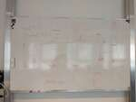
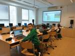
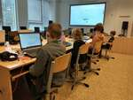

# 2024/2025

Kurz **Programování na Nuselské** bude probíhat od 19. září 2024
a volně navazuje na kurz **začátečníci**. Je určen pro děti druhých
až pátých tříd libovolné základní školy s tím, že děti druhých
tříd musí mít absolvovaný kurz začátečníci, šikovní jedinci z
řad třetích či čtvrtých tříd mohou přijít i bez předchozího
vzdělání.

Cílem tohoto kurzu je pokračování v rozvoji systematického
myšlení, hlubší poznávání světa informační techniky
a osvojení si základů elektrotechniky.

Kurz bude probíhat 1x týdně, každý čtvrtek od 14:15 do 15:05
v počítačové učebně.

V kurzu budeme využívat robůtky [Cubetto](https://www.primotoys.com),
[Beebot](https://www.bee-bot.us/) i [Ozobot](https://ozobot.com/).
Později si představíme platformu [Micro:bit](https://microbit.org)
a s ní zabředneme trochu blíže k elektrotechnice. Kromě těchto
se budeme věnovat i práci na PC, kde se budeme učit programovat
pomocí vybraných kurzů na [code.org](https://www.code.org),
prostředí [scratch](https://scratch.mit.edu/) a dalších.
To vše proložíme tvůrčími aktivitami s papírem, kostkami a jinými
rekvizitami.

Cílem kurzu není vzdělat hotového programátora, ale rozvíjet logické
myšlení, algoritmizaci a jiné vlastnosti, které se dětem budou hodit
při studiu jakéhokoliv oboru.

Kurz bude organizován a veden [Lukášem Doktorem](../lectors/ldoktor)

## 1. hodina (2024-09-19)

* Brainstorming ohledně projeků, kterým bychom se chtěli věnovat
* Psaní všemi deseti [s Máriem](https://archive.org/details/TYPING_VGA#)
  * Pozor, v "Lessons" nutno nastavit "Home Row Only" abychom (prozatím) využívali pouze tlačítka v prostřední řádce
  * **NIKDY** se nedívejte na klávesnici, pouze nahmatejte ukazováčky výběžky umístěné na klávesách F a J a rozprostřete prsty vedle sebe, palce na mezerník
  * Využívejte lekci 1, kde vám Mário radí, kterým prstem které ruky psát
  * Písmena FG a JH jsou obsluhována ukazováčky, vždy se po stisku G či H vraťte na původní pozici
  * Znak `;` se ukazuje jako pravý malíček, na české klávesnici se ale nalézá vlevo vzadu nad klávesou Tab (nalevo od +/1). Časem se jej naučíte mačkat bez dívání a rychle (mě pomáhá opřít se palcem o mezerník, roztáhnout prsty správným směrem a zmáčknout).

## 2. hodina (2024-09-26)

* Psaní všemi deseti [s Máriem](https://archive.org/details/TYPING_VGA#)
* [scratch](https://scratch.mit.edu)
  * Brainstorming ohledně téma hry (Fotbal vs. Basketbal)
  * Připomenutí prostředí scratch
  * Základní scéna

## 3. hodina (2024-10-04)

* Psaní všemi deseti [s pomocí umimeinformatiku](https://www.umimeinformatiku.cz/psani-vsemi-deseti)
* [scratch](https://scratch.mit.edu)
  * Naučili jsme míč následovat "x" souřadnici myši a vystřelit jej kliknutím tlačítka myši

## 4. hodina (2024-10-10)

* [scratch](https://scratch.mit.edu)
  * Naučili jsme brankáře chodit a chytnout míč

## 5. hodina (2024-10-17)

* Psaní všemi deseti [s pomocí umimeinformatiku](https://www.umimeinformatiku.cz/psani-vsemi-deseti)
* [scratch](https://scratch.mit.edu)
  * Přidali jsme body a na tabuli jsme si probrali podmínky pro jejich přidělení

## 6. hodina (2024-10-24)

* Psaní všemi deseti [s pomocí umimeinformatiku](https://www.umimeinformatiku.cz/psani-vsemi-deseti)
* [scratch](https://scratch.mit.edu)
  * S velkým vypětím jsme naučili počítač rozeznat kdy branka padla a kdy ne
  * (1) dotýkáš se brankáře? (-1b)
  * (2) jsi na levo od levé tyče? (-1b)
  * (3) jsi na levo od pravé tyče? (+1b)
  * (4) (-1b)
  * Pozor, záleží na pořadí!

## 7. hodina (2024-10-31)

* Psaní všemi deseti [s pomocí umimeinformatiku](https://www.umimeinformatiku.cz/psani-vsemi-deseti)
* [scratch](https://scratch.mit.edu)
  * Opravy chybek
  * Vylepšování hry o zvuky, animace, easter eggy...

