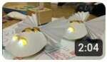
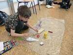
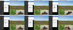
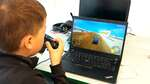
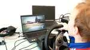
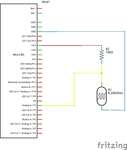
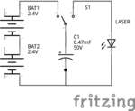

# 2024/2025

Kurz **Programování na Nuselské** bude probíhat od 19. září 2024
a volně navazuje na kurz **začátečníci**. Je určen pro děti druhých
až pátých tříd libovolné základní školy s tím, že děti druhých
tříd musí mít absolvovaný kurz začátečníci, šikovní jedinci z
řad třetích či čtvrtých tříd mohou přijít i bez předchozího
vzdělání.

Cílem tohoto kurzu je pokračování v rozvoji systematického
myšlení, hlubší poznávání světa informační techniky
a osvojení si základů elektrotechniky.

Kurz bude probíhat 1x týdně, každý čtvrtek od 14:15 do 15:05
v počítačové učebně.

V kurzu budeme využívat robůtky [Cubetto](https://www.primotoys.com),
[Beebot](https://www.bee-bot.us/) i [Ozobot](https://ozobot.com/).
Později si představíme platformu [Micro:bit](https://microbit.org)
a s ní zabředneme trochu blíže k elektrotechnice. Kromě těchto
se budeme věnovat i práci na PC, kde se budeme učit programovat
pomocí vybraných kurzů na [code.org](https://www.code.org),
prostředí [scratch](https://scratch.mit.edu/) a dalších.
To vše proložíme tvůrčími aktivitami s papírem, kostkami a jinými
rekvizitami.

Cílem kurzu není vzdělat hotového programátora, ale rozvíjet logické
myšlení, algoritmizaci a jiné vlastnosti, které se dětem budou hodit
při studiu jakéhokoliv oboru.

Kurz bude organizován a veden [Lukášem Doktorem](../lectors/ldoktor)

## 1. hodina (2024-09-19)

* Brainstorming ohledně projeků, kterým bychom se chtěli věnovat
* Psaní všemi deseti [s Máriem](https://archive.org/details/TYPING_VGA#)
  * Pozor, v "Lessons" nutno nastavit "Home Row Only" abychom (prozatím) využívali pouze tlačítka v prostřední řádce
  * **NIKDY** se nedívejte na klávesnici, pouze nahmatejte ukazováčky výběžky umístěné na klávesách F a J a rozprostřete prsty vedle sebe, palce na mezerník
  * Využívejte lekci 1, kde vám Mário radí, kterým prstem které ruky psát
  * Písmena FG a JH jsou obsluhována ukazováčky, vždy se po stisku G či H vraťte na původní pozici
  * Znak `;` se ukazuje jako pravý malíček, na české klávesnici se ale nalézá vlevo vzadu nad klávesou Tab (nalevo od +/1). Časem se jej naučíte mačkat bez dívání a rychle (mě pomáhá opřít se palcem o mezerník, roztáhnout prsty správným směrem a zmáčknout).

## 2. hodina (2024-09-26)

* Psaní všemi deseti [s Máriem](https://archive.org/details/TYPING_VGA#)
* [scratch](https://scratch.mit.edu)
  * Brainstorming ohledně téma hry (Fotbal vs. Basketbal)
  * Připomenutí prostředí scratch
  * Základní scéna

## 3. hodina (2024-10-04)

* Psaní všemi deseti [s pomocí umimeinformatiku](https://www.umimeinformatiku.cz/psani-vsemi-deseti)
* [scratch](https://scratch.mit.edu)
  * Naučili jsme míč následovat "x" souřadnici myši a vystřelit jej kliknutím tlačítka myši

## 4. hodina (2024-10-10)

* [scratch](https://scratch.mit.edu)
  * Naučili jsme brankáře chodit a chytnout míč

## 5. hodina (2024-10-17)

* Psaní všemi deseti [s pomocí umimeinformatiku](https://www.umimeinformatiku.cz/psani-vsemi-deseti)
* [scratch](https://scratch.mit.edu)
  * Přidali jsme body a na tabuli jsme si probrali podmínky pro jejich přidělení

## 6. hodina (2024-10-24)

* Psaní všemi deseti [s pomocí umimeinformatiku](https://www.umimeinformatiku.cz/psani-vsemi-deseti)
* [scratch](https://scratch.mit.edu)
  * S velkým vypětím jsme naučili počítač rozeznat kdy branka padla a kdy ne
  * (1) dotýkáš se brankáře? (-1b)
  * (2) jsi na levo od levé tyče? (-1b)
  * (3) jsi na levo od pravé tyče? (+1b)
  * (4) (-1b)
  * Pozor, záleží na pořadí!

## 7. hodina (2024-10-31)

* Psaní všemi deseti [s pomocí umimeinformatiku](https://www.umimeinformatiku.cz/psani-vsemi-deseti)
* [scratch](https://scratch.mit.edu)
  * Opravy chybek
  * Vylepšování hry o zvuky, animace, easter eggy...

## 8. hodina (2024-11-07)

* [scratch](https://scratch.mit.edu)
  * Opravy chybek
  * Vylepšování hry o zvuky, animace, easter eggy...
  * Posledních 10 minut děti prezentovali své výtvory a domluvili jsme se, že budou ještě příště dopilovávat
  * [Ukázkový program](https://scratch.mit.edu/projects/1073204273/)

## 9. hodina (2024-11-14)

* [scratch](https://scratch.mit.edu)
  * Další vylepšování, někdo přidal chůzi, jiný skoky, další plánoval možnost hodit "vajíčko" místo míče, kterému by se brankář musel vyhnout...

## 10. hodina (2024-11-21)

* [scratch](https://scratch.mit.edu)
  * Dokončení projektů [výtvor1](https://scratch.mit.edu/projects/1073203982/), [výtvor2](https://scratch.mit.edu/projects/1073204432/), [výtvor3](https://scratch.mit.edu/projects/1073204315/), [výtvor4](https://scratch.mit.edu/projects/1076320356/), [výtvor5](https://scratch.mit.edu/projects/1096509859/)
* Psaní všemi deseti [s pomocí umimeinformatiku](https://www.umimeinformatiku.cz/psani-vsemi-deseti)
  * ke konci opadala morálka, tak jsme ji nabudili hrou [epistory](https://www.epistorygame.com/), kterou si děti budou moci za odměnu zahrát, až budou umět psát dostatečně rychle.

## 11. hodina (2024-11-28)

* [www.code.org](https://www.code.org)
  * Zvolili jsme pokročilý kurz formou "speedrun". Nechceme 100% správnost, ale chceme se co nejrychleji dostat co nejdále.
* Kdo měl chuť, zavzpomínal na Cubetto

## 12. hodina (2024-12-05)

* Mikulášská nadílka
  * Pomocí Cubetta (sv. Mikuláš), Beebotů (andílci) a čerta (ozobot) jsme plánovali mikuklášskou nadílku. Použili jsme převleky od začátečníků, namalovali jsme si plán a zjistit, že je Cubetto pomalý a andílci budou muset na Mikuláše čekat.

## 13. hodina (2024-12-12)

* Mikulášská nadílka
  * Naprogramovali jsme 2 andílky (Beeboti) a sv. Mikuláše (Cubetto) aby odešel z nebe na náměstí a následně do kostela bez toho aby se srazily s čertem. Nejtěžší bylo zajistit aby natěšení andělíčkové nedobíhali pomalého Mikuláše, ale nakonec se nám to podařilo.
  * [Video](https://www.youtube.com/watch?v=OYCpFLq0GHs)

## 14. hodina (2024-12-19)

* Rozmontování, složení a spuštění počítače, popis komponent a jejich funkcí.

## 15. hodina (2025-01-09)

* Papírový model [v Blenderu](https://blender.org)
  * Seznámení s 3D animačním softwarem Blender
  * Pohled:
    * Otáčení scény - `prostřední tlačítko` (kolečko)
    * Zoom scény - `kolečko myši`
    * Posunutí scény - `shift+prostřední tlačítko`
  * Přidání objektu
    * `shift+A` nebo nahoře menu `Add` (zpravidla chceme objekty typu `Mesh`)

## 16. hodina (2025-01-16)

* Papírový model [v Blenderu](https://blender.org)
  * Opakování pohybu scény
  * Otočení - `r` (rotate), následně `x, y, z` pro otočení podle jedné osy (případně prostřední tlačítko myši)
  * Zvětšení - `s` (scale), následně `x, y, z` pro otočení podle jedné osy (případně prostřední tlačítko myši)
  * Pojmenované pohledy lze přepínat na numerické klávesnici (`1, 3, 7, 0`, případně otočení `2,4,6,8`)
  * Další soutěž s opičkou s natočeným kloboučkem o hodnotné ceny

* * * * * * * * * * *

## 17. hodina (2025-02-06)

* Papírový model [v Blenderu](https://blender.org)
  * Opakování pohybu scény a objekty (`shift-a,g,r,s,+x,+y,+z,...`)
  * Přepínání módů (vlevo nahoře myší nebo klávesa `Tab`)
    * Object mode (objektový mód) - kompozice scény
    * Edit mode (editační mód) - úprava jednotlivých objektů
  * V `edit mode` jsme si vyzkoušeli označení `bodu`, `hrany` a `plochy`, jejich posunutí, rotaci a velikost. Nakonec jsme si ukázali, že můžeme plochu "vytlačit do prostoru pomocí "extrude" `e` a tím rozšířit náš objekt.

## 18. hodina (2025-02-13)

* Papírový model [v Blenderu](https://blender.org)
  * Opakování (`shift-a,g,r,s,+x,+y,+z,tab,1,2,3,...`)
  * Společná tvorba banánu
    * Boční pohled `num1`
    * Přidáme si referenční obrázek (`shift+a->image->reference...`)
    * Přidáme si "profil" banánu `shift+a->mesh->cylinder` a ihned klikneme v pravo dole na nové tlačítko `> add cylinder` a upravíme `verteces` na 5 či 7, případně i velikost a výšku
    * otočíme a posuneme na střed banánu
    * přepneme do edit modu `tab`
    * otočíme si pohled a vybereme podstavu (mód výběru `face` tlačítkem `3`)
    * vrátíme se zpět do bořního pohledu `num1`
    * pomocí `e` (extrude), `r` (rotate), `s` (scale) a `g` (grab) postupně "obkreslíme" referenční obrázek

## 19. hodina (2025-02-20)

* Papírový model [v Blenderu](https://blender.org)
  * Individuální tvorba modelů - [Banán](pokrocili-2-03-banan.blend) ([tisk](pokrocili-2-03-banan.pdf))
  * Ostatní psaní všemi deseti, hledání referenčních obrázků a vlastní tvorba

## 20. hodina (2025-02-27)

* Algoritmy
  * [Pěkné video vysvětlující co to jsou algoritmy](https://www.youtube.com/watch?v=HsO2reAF0IA)
  * Seřazení žáků dle výšky bez poheldu na celé pole (žák stojí zády a ptá se na 2 pozice, dozví se pouze který z žáků na těchto pozicích je větší)
  * Předvedení základních třídících algoritmů a jejich diagramů [pdf](../2022_2023/sort.pdf), [odg](../2022_2023/sort.odg)
  * Krátká ukázka rozdílu mezi algoritmem, programem a strojovým kódem [pdf](../2022_2023/gcd-disassembly.pdf), [odt](../2022_2023/gcd-disassembly.odt)
  * Do budoucna doporučuji schovat si odkaz na pěknou literaturu [zde](https://knihy.nic.cz/files/edice/pruvodce_labyrintem_algoritmu.pdf)

## 21. hodina (2025-03-13)

* Papírový model [v Blenderu](https://blender.org)
  * Společná tvorba auta
    * Boční pohled `num1`
    * Přidáme si referenční obrázek (`shift+a->image->reference...`)
    * Označíme si krychly (pokud jsme ji smazali, tak ji přidáme pomocí `shift+a->mesh->cube`)
    * Přepneme do edit modu `tab`
    * Sloučíme všechny body pomocí `Pravé tlačítko->merge verteces->at center` (pokud jsme si odznačili, označíme pomocí `A`, případně přepneme mód výběru na body `1`)
    * `g` přesuneme bod na vhodné místo
    * Pomocí `e` přidáváme další body (staré můžeme dále přesouvat pomocí `g`, vždy vyberte pouze jeden bod)
    * Poslední bod musíme sloučit, uděláme to opět tak, že vybereme 2 body (přes shift, nebo tažením) a dáme `Pravé tlačítko->merge verteces->at center` (případně `At first` či `At last`)
    * Označíme všechny body a vytlačíme pomocí `e`, případně označíme pouze jednu osu (`x`, `y`, `z`)
    * Můžeme opakovat vícekrát dle potřeby, případně zvětšit, zmenšit, posunout
    * Poslední vrstvu chceme překrýt plochou, uděláme to pomocí klávesy `f`
    * Můžeme využít `mirror` (zrcadlový) modifikátor, abychom snadno vytvořili symetrický model (např. podle osy `y`)
    * Můžeme přidat detaily pomocí označení plochy a `e`, případně `i`, případně přidat další hrany pomocí `k` knife (nože)
* [zonerai - generátor obrázků](https://zonerai.com) - vyzkoušeli jsme si generovat různé zábavné obrázky pomocí umělé inteligence (a procvičili jsme si psaní
na klávesnici)

## 22. hodina (2025-03-20)

* Papírový model [v Blenderu](https://blender.org)
  * Individuální tvorba modelů - [pistole](pokrocili-2-06-pistole.blend) ([tisk](pokrocili-2-06-pistole.pdf))

## 23. hodina (2025-03-27)

* Papírový model [v Blenderu](https://blender.org)
  * Individuální tvorba modelů - [ptacek](pokrocili-2-07-ptacek.blend) ([tisk](pokrocili-2-07-ptacek.pdf))

## 24. hodina (2025-04-03)

* Papírový model [v Blenderu](https://blender.org)
  * Exportované modely pomocí "paper model extension" jsme stříhali a lepili.
  * Před vystřižením přepíšeme čísílka dovnitř modelu, následně vystřihnu velký díl, jemně přejedu podle pravítka nůžkami/kružítkem každý přehyb a předohýbám. Následně shodně zpracuji další ostrov (island) který se připojí k tomuto modelu (např. I2:6 znamená, že se k tomuto dílu připojí strana 6 z ostrovu Island 2) a slepím. Postupuji, dokud není model kompletní.
  * Čerchovaná čára (`- * - * -`) == ohýbání jedním směrem, čárkovaná čára (`- - - - -`) == ohýbání druhým směrem. Ideální je lepit "inverzně", tj. vnější/bílou stranou ven. Vyžaduje to ovšem pečlivé namazání lepených plošek, které z této strany nejsou naznačeny.

## 25. hodina (2025-04-10)

* Papírový model [v Blenderu](https://blender.org)
  * Dopomoc s lepením
  * Kdo měl hotovo, mohl si za odměnu zkusit nějakou z her (OpenTTD, LFS demo na myši, Epistory, shapez, minetest, HRM)

## 26. hodina (2025-04-24)

* Opakovali jsme cykly (z loňského roku) s BB-8 v [code.org](https://www.code.org)

## 27. hodina (2025-05-15)

* Opakovali jsme cykly (z loňského roku) s BB-8 v [code.org](https://www.code.org) a vnořené cykly v bludišti
* Dodělání posledního papírového modelu

## 28. hodina (2025-05-22)

* [Micro:bit](../assets/microbit)
  * Opakování
  * Tvorba testovacího programu k laserové střelnici, prozatím pouze pomocí tlačítek

## 29. hodina (2025-05-29)

* Počítačové periferie
  * Rozdělení - vstupní (input), výstupní (output) a vstupně-výstupní (in-out)
    * vstupní - klávestnice, myš, joystick, kamera, ... - zpravidla přes USB port
    * výstupní - monitor (HDMI, display port), tiskárna (USB port), reproduktory (jack), ...
    * vstupně-výstupní - síťová karta (RJ-45), externí disk, volant s force-feedbackem, ... - zpravidla přes USB port
  * Praktický test různých periferií:
    * Volant Logitech G25 s force feedbackem (zpětná odezva téměř jako u auta) a 900° otáčením ve hře Dirt 3
    * [Micro:bit](../assets/microbit) vložený do [Waveshare](https://github.com/waveshare/JoyStick) joysticku připojený do PC a pomocí [pythonu](https://github.com/ldoktor/microbit-waveshark-joy-pc-control) tvářícího se jako joystick ve hře [Flight Gear](https://www.flightgear.org/) - joystick ovládal křídélka (otočení vlevo-vpravo) a výškové kormidlo (nahoru-dole), naklonění microbitu pak směrové kormidlo (jemné korekce, zatáčení na zemi)
    * [Micro:bit](../assets/microbit) připojený do PC a pomocí [pythonu](https://github.com/ldoktor/microbit-waveshark-joy-pc-control) tvářícího se jako joystick ve hře [SuperTuxKart](https://supertuxkart.net) - pro legraci jsme využili senzor naklonění pro akceleraci/brždění a mikrofon pro ovládání zatáčení (ticho doleva, křik doprava)

## 30. hodina (2025-06-05)

* [Micro:bit](../assets/microbit)
  * Výroba pohyblivého terče pomocí [lega/wonder building kitu](https://ldoktor.github.io/assets/microbit/#wonder-building-kit)

## 31. hodina (2025-06-12)

* [Micro:bit](../assets/microbit)
  * [Zapojení terče](pokrocili2-2-10-terc.fzz) - napětí se rozdělí mezi pull-up rezistor a fotorezistor, hodnota fotorezistoru se mění dle osvětlení a tím se nám mění napětí, které micro:bit naměří na pinu 1
  * čtení jeho hodnoty pomocí micro:bitu (číslo z pinu P1 nám vrátí hodnotu 0 - 1023 dle osvětlení fotorezistoru)
  * [Zapojení laseru](pokrocili2-2-10-laser.fzz)
    * při vypnutém tlačítku je připojena baterie na kondenzátor, ten se nabije a obvod setrvává "v klidu"
    * po stisknutí tlačítka se odpojí baterie a připojí se kondenzátor na laserovou diodu. Přebytek elektronů putuje skrz diodu, kondenzátor se vybíjí a dioda svítí. Když se kondenzátor vybije, přestane tlačit elektrony skrz diodu a ta zhasne.

## 32. hodina (2025-06-19)

* [Micro:bit](../assets/microbit)
  * Co nejrychleji jsme se pokusili doprogramovat kód všech terčů, ale bohužel jsme nestili odladit vše (sklopit místo vyklopit, chybějící podmínky, špatné názvy). Prostě chybělo málo ale velmi krátce jsme si vyzkoušeli střelbu na jeden funkční terč bez měření času.

  &#9664;
  
  &#9654;
  &times;

<link rel="stylesheet" href="/assets/gallery.css">

