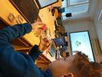
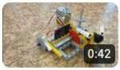
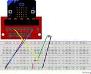
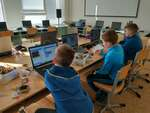
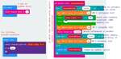
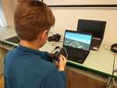
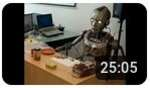

# 2024/2025

Kurz **Programování na Nuselské** bude probíhat od 19. září 2024
a volně navazuje na kurz **začátečníci**. Je určen pro děti druhých
až pátých tříd libovolné základní školy s tím, že děti druhých
tříd musí mít absolvovaný kurz začátečníci, šikovní jedinci z
řad třetích či čtvrtých tříd mohou přijít i bez předchozího
vzdělání.

Cílem tohoto kurzu je pokračování v rozvoji systematického
myšlení, hlubší poznávání světa informační techniky
a osvojení si základů elektrotechniky.

Kurz bude probíhat 1x týdně, každý čtvrtek od 15:15 do 16:05
v počítačové učebně.

V kurzu budeme využívat robůtky [Cubetto](https://www.primotoys.com),
[Beebot](https://www.bee-bot.us/) i [Ozobot](https://ozobot.com/).
Později si představíme platformu [Micro:bit](https://microbit.org)
a s ní zabředneme trochu blíže k elektrotechnice. Kromě těchto
se budeme věnovat i práci na PC, kde se budeme učit programovat
pomocí vybraných kurzů na [code.org](https://www.code.org),
prostředí [scratch](https://scratch.mit.edu/) a dalších.
To vše proložíme tvůrčími aktivitami s papírem, kostkami a jinými
rekvizitami.

Cílem kurzu není vzdělat hotového programátora, ale rozvíjet logické
myšlení, algoritmizaci a jiné vlastnosti, které se dětem budou hodit
při studiu jakéhokoliv oboru.

Kurz bude organizován a veden [Lukášem Doktorem](../lectors/ldoktor)

## 1. hodina (2024-09-19)

* Brainstorming ohledně projeků, kterým bychom se chtěli věnovat
* Psaní všemi deseti [s Máriem](https://archive.org/details/TYPING_VGA#)
  * Pozor, v "Lessons" nutno nastavit "Home Row Only" abychom (prozatím) využívali pouze tlačítka v prostřední řádce
  * **NIKDY** se nedívejte na klávesnici, pouze nahmatejte ukazováčky výběžky umístěné na klávesách F a J a rozprostřete prsty vedle sebe, palce na mezerník
  * Využívejte lekci 1, kde vám Mário radí, kterým prstem které ruky psát
  * Písmena FG a JH jsou obsluhována ukazováčky, vždy se po stisku G či H vraťte na původní pozici
  * Znak `;` se ukazuje jako pravý malíček, na české klávesnici se ale nalézá vlevo vzadu nad klávesou Tab (nalevo od +/1). Časem se jej naučíte mačkat bez dívání a rychle (mě pomáhá opřít se palcem o mezerník, roztáhnout prsty správným směrem a zmáčknout).

## 2. hodina (2024-09-26)

* Psaní všemi deseti [s Máriem](https://archive.org/details/TYPING_VGA#)
* Papírový model [v Blenderu](https://blender.org)
  * Seznámení s 3D animačním softwarem Blender
  * Pohled:
    * Otáčení scény - `prostřední tlačítko` (kolečko)
    * Zoom scény - `kolečko myši`
    * Posunutí scény - `shift+prostřední tlačítko`
  * Přidání objektu
    * `shift+A` nebo nahoře menu `Add` (zpravidla chceme objekty typu `Mesh`)
  * posun objektu - `g` (grab - uchytit)
    * kdykoliv při posunu můžeme stisknout `x, y, z` a přepnout posouvání objektu pouze v jednom směru (levo-pravo, dopředu-dozadu, nahoru-dolu)
  * Vytvořili jsme si opičku s kloboučkem

## 3. hodina (2024-10-04)

* Psaní všemi deseti [s pomocí umimeinformatiku](https://www.umimeinformatiku.cz/psani-vsemi-deseti)
* Papírový model [v Blenderu](https://blender.org)
  * Opáčko
  * Otočení - `r` (rotate), následně `x, y, z` pro otočení podle jedné osy (případně prostřední tlačítko myši)
  * Zvětšení - `s` (scale), následně `x, y, z` pro otočení podle jedné osy (případně prostřední tlačítko myši)
  * Pojmenované pohledy lze přepínat na numerické klávesnici (`1, 3, 7, 0`, případně otočení `2,4,6,8`)
  * Další soutěž s opičkou s natočeným kloboučkem o hodnotné ceny

## 4. hodina (2024-10-10)

* Psaní všemi deseti [s pomocí umimeinformatiku](https://www.umimeinformatiku.cz/psani-vsemi-deseti)
* Papírový model [v Blenderu](https://blender.org)
  * Opáčko (`shift-a,g,r,s,+x,+y,+z,...`)
  * Přepínání módů (vlevo nahoře myší nebo klávesa `Tab`)
    * Object mode (objektový mód) - kompozice scény
    * Edit mode (editační mód) - úprava jednotlivých objektů
  * V `edit mode` jsme si vyzkoušeli označení `bodu`, `hrany` a `plochy`, jejich posunutí, rotaci a velikost. Nakonec jsme si ukázali, že můžeme plochu "vytlačit do prostoru pomocí "extrude" `e` a tím rozšířit náš objekt.
  * Udělali jsme si malou, krychlovou krabičku (`shift+a` `mesh->cube`, `tab`, označit horní plochu, `e`, `s`, trochu zmenšit, `e` posunout dolu)

## 5. hodina (2024-10-17)

* Psaní všemi deseti [s pomocí umimeinformatiku](https://www.umimeinformatiku.cz/psani-vsemi-deseti)
* Papírový model [v Blenderu](https://blender.org)
  * Opáčko (`shift-a,g,r,s,+x,+y,+z,tab,výběr-bod/hrana/plocha...`)
  * První vedené modelování
  * Rozdělení plochy na menší části - `pravé tlačítko-subidvide`
  * nástroje `loop cut` ("rozřízne" objekt na dásti), `Add cube` (umožní přidat objekt k existujícímu objektu v edit módu)

## 6. hodina (2024-10-24)

* Psaní všemi deseti [s pomocí umimeinformatiku](https://www.umimeinformatiku.cz/psani-vsemi-deseti)
* Papírový model [v Blenderu](https://blender.org)
  * Vrhli jsme se do tvorby banánu.
  * Nejprve jsme si na internetu stáhli vzorový obrázek (pohled z boku), uložili jej a v blender přidali pomocí `shift+a` `image->reference`. Následně jsme jej správně natočili a posunuli aby nám nepřekážel v tvorbě.
  * Z bočního pohledu `1` jsme si umístili a zmenšili kostku tak, aby odpovídala jednomu segmentu banánu.
  * V pravo nahoře jsme si zapnuli průhlednost `Toggle X-Ray`
  * Přepnuli do `edit mode` pomocí `tab`
  * Nyní už jen označit jednu stranu a kombinovat `e` (extrude), `r` (rotate) a `s` (scale) a za chviličku je tu náš banán

## 7. hodina (2024-10-31)

* Psaní všemi deseti [s pomocí umimeinformatiku](https://www.umimeinformatiku.cz/psani-vsemi-deseti)
* Papírový model [v Blenderu](https://blender.org)
  * Pokusili jsme se o zjednodušený model `SIG Sauer P250` ale tentokrát se nám moc nedařilo. Příště se snad vrátíme k banánu a poučeni z předchozích nezdarů budeme šikovnější a rychlejší (poznámka: vynechat psaní deseti abychom stihli modelování)

## 8. hodina (2024-11-07)

* Papírový model [v Blenderu](https://blender.org)
  * Vytvořili jsme banán [blend](pokrocili2-1-08-blender.blend)
  * Zmenšili jej na požadovanou velikost (podle velikosti baterií)
  * Nainstalovali jsme si "Export Paper Model" plugin
    * `Edit->Preferences...
    * `Get Extension`
    * Vyhledat "paper"
    * Kliknout na "Install"
  * Export jako model:
    * Kliknout na `<` v pravo nahoře, kde přibude "Paper" záložka
    * "Unfold" - pokud selže přepnout do "Edit mode" (`tab`) a dát `Face->Triangulate faces`; v případě chyb jako `zero area` použijte v "Edit mode" `Mesh->Clean Up->Degenerate Dissolve` a opět zkusíme "Unfold", případně opakujeme
    * Nakonec "Export Paper Model", vybereme kam a případně měřítko
    * Výsledek [pdf](pokrocili2-1-08-blender.pdf)

## 9. hodina (2024-11-14)

* Papírový model [v Blenderu](https://blender.org)
  * Další pokus o pistol
  * Využili jsme `Mesh->Plain` a obkreslili jsme si základní tvar. Další části jsme přidávali buď pomocí `pravé tlačítko na hraně->Subdivide` nebo pomocí `e` (extrude) také na hraně.
  * Následně jsme označili vše a "vytáhli do prostoru" pomocí `e` (extrude)
  * Smazali jsme všechny plochy na vnitřní straně (označit plochy, delete, faces)
  * Přidali jsme modifikátor (v pravo dole modrá ikonka klíče - modiffiers) zrcadlení (mirror), zvolili správnou osu a zapnuli `Clipping` (aby zůstaly kraje propojené i při posunu)
  * Začali jsme dělat zaměřovač a další drobnosti, které nejsou přes celé. K tomu jsme používali nástroj (ikonka vlevo) loop cut, případně knife.
  * Vše jsme uložili `ctrl+s` a doufáme, že příště doděláme.

## 10. hodina (2024-11-21)

* Papírový model [v Blenderu](https://blender.org)
  * Věnovali jsme se dalším modelům, už nám zbývá pouze jeden a půl...

## 11. hodina (2024-11-28)

* Papírový model [v Blenderu](https://blender.org)
  * Dodělali jsme pistoli a auto, čímž uzavíráme kapitolu Blender. Pár rad na doma:
  * Na [youtube](https://www.youtube.com/results?search_query=blender+tutorial) najdete spoustu návodů, většinou s možností zapnout titulky a automatickým překladem.
  * Zpravidla je postup:
    * Změním pohled na boční/horní (`3` nebo `7`)
    * Přidám referenční obrázek (`shift+a`, `image->reference`)
    * Přidám Plain (`shift+a`, `mesh->plain`)
    * V edit módu sloučím včechny body meshe do jednoho (`tab`, `a`, `pravé tlačítko`, `merge vertices->At center`), čímž získám původní bod
    * Co nejmenším počtem bodů "obkreslím" obrys objektu (`e`), případně upravím umístění pomocí `g` (grab - uchopit)
    * Označím vše (`a`) a "vytlačím" obrys do prostoru (`e`)
    * Následně kombinuji posun (`e`), otáčení (`r`), zvětšení (`s`) na bodech/úsečkách/plochách, vytlačování (`e`) a v neposlední řadě ještě nůž `k` a řezání `ctrl+r`.
  * Pro symetrické prvky využívám "modifikátor" (na pravé straně v dolní části symbol klíče) `mirror`
  * Často měňte pohledy (nebo využijte velký display a rozdělte si plochu na několik pohledů současně)

## 12. hodina (2024-12-05)

* Předání modelů a diskuze na téma 3d tisk [banán](pokrocili2-1-12-banan.pdf), [auto](pokrocili2-1-12-auto.pdf), [pistole1](pokrocili2-1-12-pistole1.pdf), [pistole2](pokrocili2-1-12-pistole2.pdf), [charmander](pokrocili2-1-12-charmander.pdf)[+barevně označené části](pokrocili2-1-12-charmander-casti.pdf)
* Rychlokurz lepení papírových modelů
  * Opatrně obstříhnu okolo
  * Ze zadní strany tuškou zapíšu informace o čísle dílu (island - ostrov)
  * Ze zadní strany tuškou přepíšu informaci která ploška se kam bude lepit
  * Lehce obtáhnu čárkované a čerchované čáry nůžkami/kružítkem podle pravítka!
  * Díl si lehce předohýbám, v místě čárkované čáry dovnitř, v místě čerchované čáry směrem ven
  * Najdu plošku s označením vystřiženého dílu (`I1:2` znamená přilep tuto plošku k dílu číslo 1 na místo označené číslem 2), opakuji předešlé body pro tento díl
  * Slepím díly dohromady
  * Opakuji dokud není celý model kompletní. Zpravidla doporučuji začít velkým výzanmýn dílem a pokračovat k menším, ale je to o citu. Případně můžete zkusit jako rozcvičku "miniboxy" z časopisu ABC
* Mikulášská nadílka
  * Pomocí Cubetta (sv. Mikuláš), Beebotů (andílci) a čerta (ozobot) jsme plánovali mikuklášskou nadílku. Použili jsme převleky od začátečníků, plán od pokročilých a zjistili jsme, že Cubetto je pomalejší než Beebot a tak budou muset andílci na Mikuláše čekat.

## 13. hodina (2024-12-12)

* Papírový model
  * Někteří mě příjemně překvapily a donesli slepené modely, viz. fotky
* [Micro:bit](../assets/microbit)
  * Připomněli jsme si prostředí [makecode](https://makecode.microbit.org/) a vyzkoušeli jsme si pár základních prográmků

## 14. hodina (2024-12-19)

* Rozmontování, složení a spuštění počítače, popis komponent a jejich funkcí.

## 15. hodina (2025-01-09)

* [Micro:bit](../assets/microbit)
  * Seznámení s ``Wonder Building Kitem``

## 16. hodina (2025-01-16)

* [Micro:bit](../assets/microbit)
  * Stavba ``Wonder Building Kit`` projektů

## 17. hodina (2025-02-06)

* [Micro:bit](../assets/microbit)
  * Stavba ``Wonder Building Kit`` projektů

## 18. hodina (2025-02-13)

* [Micro:bit](../assets/microbit)
  * Dokončování ``Wonder Building Kit`` projektů
  * Ukázka zapojení fotorezistoru, vysvětlení jak se rozdělí napětí mezi pull-up rezistor a fotorezistor, jak se výstup změní při osvětlení fotorezistoru a co naměříme na microbitu.

## 19. hodina (2025-02-20)

* [Micro:bit](../assets/microbit)
  * Motorka na dálkové ovládání pomocí microbit + ``Wonder Building Kit``, vlastní model od Kuby a odladění dálkového ovládání (ostatní byli nemocní/chyběli)
  * [Video](https://www.youtube.com/watch?v=GONJSyvt234)

## 20. hodina (2025-02-27)

* Algoritmy
  * [Pěkné video vysvětlující co to jsou algoritmy](https://www.youtube.com/watch?v=HsO2reAF0IA)
  * Seřazení žáků dle výšky bez poheldu na celé pole (žák stojí zády a ptá se na 2 pozice, dozví se pouze který z žáků na těchto pozicích je větší)
  * Předvedení základních třídících algoritmů a jejich diagramů [pdf](../2022_2023/sort.pdf), [odg](../2022_2023/sort.odg)
  * Krátká ukázka rozdílu mezi algoritmem, programem a strojovým kódem [pdf](../2022_2023/gcd-disassembly.pdf), [odt](../2022_2023/gcd-disassembly.odt)
  * Do budoucna doporučuji schovat si odkaz na pěknou literaturu [zde](https://knihy.nic.cz/files/edice/pruvodce_labyrintem_algoritmu.pdf)

## 21. hodina (2025-03-13)

* [Micro:bit](../assets/microbit)
  * Zapojení fotorezistoru na breadboardu - napětí se rozdělí mezi pull-up rezistor a fotorezistor, hodnota fotorezistoru se mění dle osvětlení a tím se nám mění na
pětí, které micro:bit naměří na pinu 1
* [zonerai - generátor obrázků](https://zonerai.com) - vyzkoušeli jsme si generovat různé zábavné obrázky pomocí umělé inteligence (a procvičili jsme si psaní
na klávesnici)

## 22. hodina (2025-03-20)

* [Micro:bit](../assets/microbit)
  * Tvorba programu pro detekci světla a opakování zapojení fotorezistoru

## 23. hodina (2025-03-27)

* [Micro:bit](../assets/microbit)
  * Test terče a tvorba platformy s pohyblivým uchycením terče

## 24. hodina (2025-04-03)

* [Micro:bit](../assets/microbit)
  * Finální montáž nabarvených terčů, návrh hry a protokolu mezi.
  * Hra bude náhodně vyklápět jednotlivé terče a měřit, za jak dlouho je stihneme trefit. Skončí po 10 trefených terčích a vypíše celkový čas.
  * Protokol je:
    * vyklop (server->terč)
    * trefa (terč->server)
    * reset (server->terč)

## 25. hodina (2025-04-10)

* [Micro:bit](../assets/microbit)
  * Návrh protokolu mezi serverem a terči
  * Ladění nových terčů (stříbrná barva místo alobalu)
  * Oprava kódu z minule

## 26. hodina (2025-04-24)

* Zapojení laserů v modelu
  * Bojovali jsme s propojením drátků (pájení by bylo lepší, ale hůře rozebíratelné)
  * Někdy jsme museli destruktivně vyjmout vypínače, abychom zapojili a izolepou zajistili drátky
  * Využíváme 2x2xAAA nabíjecí baterie = 2x2x1.2V = 4.8V (laser snese 5V) a 470pF kondenzátory [zapojení](pokrocili2-2-10-laser.fzz) [schéma](pokrocili2-2-10-laser_schem.svg)
    * při vypnutém tlačítku je připojena baterie na kondenzátor, ten se nabije a obvod setrvává "v klidu"
    * po stisknutí tlačítka se odpojí baterie a připojí se kondenzátor na laserovou diodu. Přebytek elektronů putuje skrz diodu, kondenzátor se vybíjí a dioda svítí. Když se kondenzátor vybije, přestane tlačit elektrony skrz diodu a ta zhasne.

## 27. hodina (2025-05-15)

* [Micro:bit](../assets/microbit)
  * Implementace terče
  * Drobné problémy s hladinou osvětlení (potřebujeme více zatemnit)
* Dodělání laserů do modelu
  * Izolepa není dostačující, modely fungují ale při použití často selhávají. Příště donesu spájenou pevnou verzi, abychom si mohli spolehlivě zahrát.

## 28. hodina (2025-05-22)

* [Micro:bit](../assets/microbit)
  * Kompletace projektu laserové střelnice a ke konci konečně test za pomocí plastové verze laserové "pistole"

## 29. hodina (2025-05-29)

* Delší test laserové střelnice
* Počítačové periferie
  * Rozdělení - vstupní (input), výstupní (output) a vstupně-výstupní (in-out)
    * vstupní - klávestnice, myš, joystick, kamera, ... - zpravidla přes USB port
    * výstupní - monitor (HDMI, display port), tiskárna (USB port), reproduktory (jack), ...
    * vstupně-výstupní - síťová karta (RJ-45), externí disk, volant s force-feedbackem, ... - zpravidla přes USB port
  * Praktický test různých periferií:
    * Volant Logitech G25 s force feedbackem (zpětná odezva téměř jako u auta) a 900° otáčením ve hře Dirt 3
    * [Micro:bit](../assets/microbit) vložený do [Waveshare](https://github.com/waveshare/JoyStick) joysticku připojený do PC a pomocí [pythonu](https://github.com/ldoktor/microbit-waveshark-joy-pc-control) tvářícího se jako joystick ve hře [Flight Gear](https://www.flightgear.org/) - joystick ovládal křídélka (otočení vlevo-vpravo) a výškové kormidlo (nahoru-dole), naklonění microbitu pak směrové kormidlo (jemné korekce, zatáčení na zemi)
    * [Micro:bit](../assets/microbit) připojený do PC a pomocí [pythonu](https://github.com/ldoktor/microbit-waveshark-joy-pc-control) tvářícího se jako joystick ve hře [SuperTuxKart](https://supertuxkart.net) - pro legraci jsme využili senzor naklonění pro akceleraci/brždění a mikrofon pro ovládání zatáčení (ticho doleva, křik doprava)

## 30. hodina (2025-06-05)

* Speedrun pokročilého kurzu [code.org](https://www.code.org)
* Kdo minule chyběl měl možnost si vyzkoušet volant i joystick a dozvěděl se něco o vstupních/výstupních/vstupně-výstupních periferiích počítače

## 31. hodina (2025-06-12)

* Speedrun pokročilého kurzu [code.org](https://www.code.org)
  * většina zvládla pokročilé cykly, někteří se dostali i na podmínky

## 32. hodina (2025-06-19)

* Hra - namaž mi toustík
 * Zábavná aktivita při které se děti snažily jednoznačně popsat sekvenci vedoucí k vytvoření lahodného toustíku

  &#9664;
  
  &#9654;
  &times;

<link rel="stylesheet" href="/assets/gallery.css">

