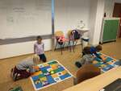

# 2024/2025

Kurz **Programování na Nuselské** bude probíhat od 19. září 2024
a je určen pro děti prvních[1](#footnote1) a druhých
tříd dětí z libovolných škol. Cílem těchto kurzů je rozvíjení
přirozené touhy dětí po poznávání okolního světa s důrazem na
techniku a rozvoj systematického myšlení.

Kurz bude probíhat 1x týdně každý čtvrtek od 13:15 do 14:05 v počítačové
učebně.

V kurzu budeme využívat robůtky [Cubetto](https://www.primotoys.com),
[Beebot](https://www.bee-bot.us/) i [Ozobot](https://ozobot.com/).
Zároveň se budeme věnovat i práci na PC pomocí open source aplikace
[GCompris](https://gcompris.net) a začneme kurzy z platformy
[code.org](https://[www.code.org](https://www.code.org)). Pro zpestření budou kurzy provázeny
tvůrčími aktivitami s papírem, kostkami a jinými rekvizitami.

Cílem kurzu není vzdělat hotového programátora, ale rozvíjet logické
myšlení, algoritmizaci a jiné vlastnosti, které se dětem budou hodit
při studiu jakéhokoliv oboru.

Kurz bude organizován a veden [Lukášem Doktorem](../lectors/ldoktor)

## 1. hodina (2024-09-19)

* Seznámení s Beeboty (včelkami) - pohyb vpřed a vzad
* Ovládání [myši](https://decko.ceskatelevize.cz/vyhledavani?q=zv%C4%9B%C5%99inec&t=app) a [klávesnice](https://decko.ceskatelevize.cz/websterovi/websterovi-vzhuru-domu)

## 2. hodina (2024-09-26)

* [www.code.org](https://www.code.org)
  * Přihlášení se (pomocí kódu sekce a obrázkového hesla)
  * Začali jsme sekci "Programujeme s Angry Birds"
* Soutěž s Beeboty (kdo přijede blíže ke kamarádovi)

## 3. hodina (2024-10-03)

* Beeboti
  * pohyb na podložce
* [www.code.org](https://www.code.org)
  * Pokračování v "Programujeme s Angry Birds"

## 4. hodina (2024-10-10)

* [www.code.org](https://www.code.org)
  * Pokračování v "Programujeme s Angry Birds"
* Beeboti
  * příběh na podložce

## 5. hodina (2024-10-17)

* Beeboti
  * společný příběh na podložce s převleky
  * DÚ - vytvořit převlek
* [www.code.org](https://www.code.org)
  * Dokončení "Angry Birds" a začátek "Debuggování se Scratem"

## 6. hodina (2024-10-24)

* [www.code.org](https://www.code.org)
  * "Debuggování se Scratem", častěji jsme využívali "krokování" místo obyčejného "spuštění"
* Beeboti
  * Děti přinesly moc krásné převleky, vytvořily s nimi pěkné příběhy a tím si je navzájem představily

## 7. hodina (2024-10-31)

* Beeboti
  * Seznámili jsme se se směrovou růžicí, Severem (N - North), Jihem (S - South), Západem (W - West) a Východem (E - East) a s tím, jak se používá v navigaci, na mapě a následně i na podložce.
  * Přesně jsme určovali pozici včelek na podložkách (A1N, E4E, C2S, ...)
  * Zkusili jsme zápis programu, ale k tomu se musíme ještě vrátit
* Ricochet Robots
  * Za odměnu jsme si zkusili pěknou logickou deskovku s roboty co nemají brzdy a musí se dostat na určená místa

## 8. hodina (2024-11-07)

* [www.code.org](https://www.code.org)
  * Cykly/opakování na tabuli (místo `-> -> ->` mohu zapsat `3x(->)` a počítač udělá to samé)
  * Sbíráme poklady s Laurelem - procvičování cyklů
  * Domácí úkol - opravit pseudo-kód pro počítač pomocí cyklů [[pdf](../2020_2021/pokrocili-1-04-peceni.pdf), [odt](../2020_2021/pokrocili-1-04-peceni.odt)], případně pošlete fotky realizace (který návod vám vyhovoval nejvíce?)

## 9. hodina (2024-11-14)

* Cubetto
  * Seznámaní se s "Kubíkem"
  * Dostaň se z místa A do místa B
  * Dostaň se z místa A do místa B a bez změny kódu opětovným spuštěním zpět do A

## 10. hodina (2024-11-21)

* [www.code.org](https://www.code.org)
  * Sbíráme poklady s Laurelem - pokračování v cyklech
  * Domácí úkol - kontrola a ukázka z přípravy
* Ricochet Robot
  * Pěkná deskovka na logické uvažování

## 11. hodina (2024-11-28)

* Cubetto
  * Hra "kouknu a vidím" (vágně popíši kam se chce Kubík podívat, děti se tam dostanou a vysvětlí, proč toto políčko vyhovuje zadání)
  * Naučili jsme se "modrý" bloček - "funkci". Kubík místo něj vykoná cokoliv mu nadefinujeme ve spodní části.

## 12. hodina (2024-12-05)

* Mikulášská nadílka
  * Pomocí Cubetta (sv. Mikuláš), Beebotů (andílci) a čerta (ozobot) jsme plánovali mikuklášskou nadílku. Stihli jsme vyrobit převleky a namalovat plán, příští hodinu budeme programovat.

## 13. hodina (2024-12-12)

* Mikulášská nadílka
  * Naprogramovali jsme 2 andílky (Beeboti) a sv. Mikuláše (Cubetto) aby odešel z nebe na náměstí a následně do kostela bez toho aby se srazily s čertem. Nejtěžší bylo zajistit aby natěšení andělíčkové nedobíhali pomalého Mikuláše, ale nakonec se nám to podařilo.

## 14. hodina (2024-12-19)

* Rozmontování, složení a spuštění počítače, popis komponent a jejich funkcí. Test ochrany proti přehřátí (thermal throttling) pomocí upravené hry housenka a odstranění chladiče.

## 15. hodina (2025-01-09)

* [www.code.org](https://www.code.org)
  * Pokračování v cyklech
* Lehký úvod do elektroniky
  * <a href="https://cs.wikipedia.org/wiki/Tesl%C5%AFv_transform%C3%A1tor">Teslův transformátor</a>
    * malinký transformátor z Aliexpresu
    * vytahování oblouku pomocí klíčů
    * přehrávání hudby pomocí jiskření (se nám nepovedlo)
    * bezdrátové rozsvěcení úsporných žárovek, diod a tlumivek

* * * * * * * * *

<a name="footnote1">1</a>: Dle psychologa [Jeana Piageta](https://cs.wikipedia.org/wiki/Jean\_Piaget)
nelze děti mladší 6-7 let učit systematické vědy, neboť se nacházejí
ve stádiu `názorového (prelogického) myšlení`, které ještě plně
nerespektuje logiku. Ukázka experimentu je ke shlédnutí například
[zde](https://www.youtube.com/watch?v=tQLpysTbFso) (doporučuji vyzkoušet),
výuka mateřského jazyku začíná také daleko dříve, než je děťátko schopné
jej pochopit a přirozeně se vytváří návyky a spoje, jež jednou vedou v
schopnost mluvit a myslet v daném jazyce. Bilingvální výchova pak vede
ke schopnosti mluvit a myslet ve více jazycích. Proto věřím, že správným
přístupem lze začít daleko dříve a sám využívám logické hry, roboty i
počítač ke hře a vlastně i výuce svých dětí takřka od narození.

